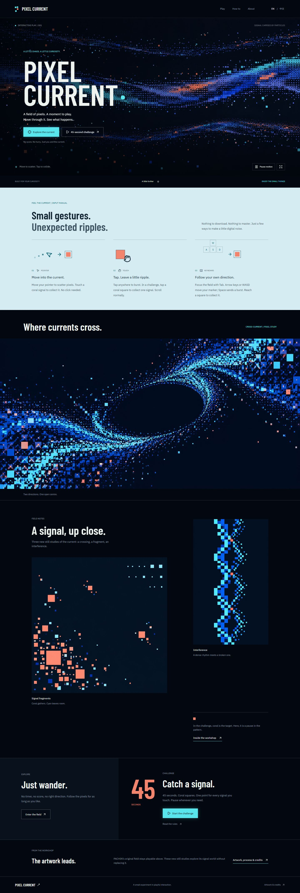

# Pixel Collision

[Live demo](https://pachin1919.github.io/pixel-collision-motion-preview/)


A painted pixel current with local particle collisions, bounded bursts and a separate interactive play area.

## Pages

- /
- /play
- /how-to
- /about

## Run locally

```powershell
npm.cmd install
npm.cmd run dev
```

Build the static site with `npm.cmd run build`.

[Deployment](docs/GITHUB-PAGES.md) · [Asset provenance](docs/ASSETS.md) · [Third-party notices](THIRD_PARTY_NOTICES.md)

A visual concept, not a commercial product or service. Original artwork and code are not offered under a general open-source license. Font and dependency licenses are retained separately.


