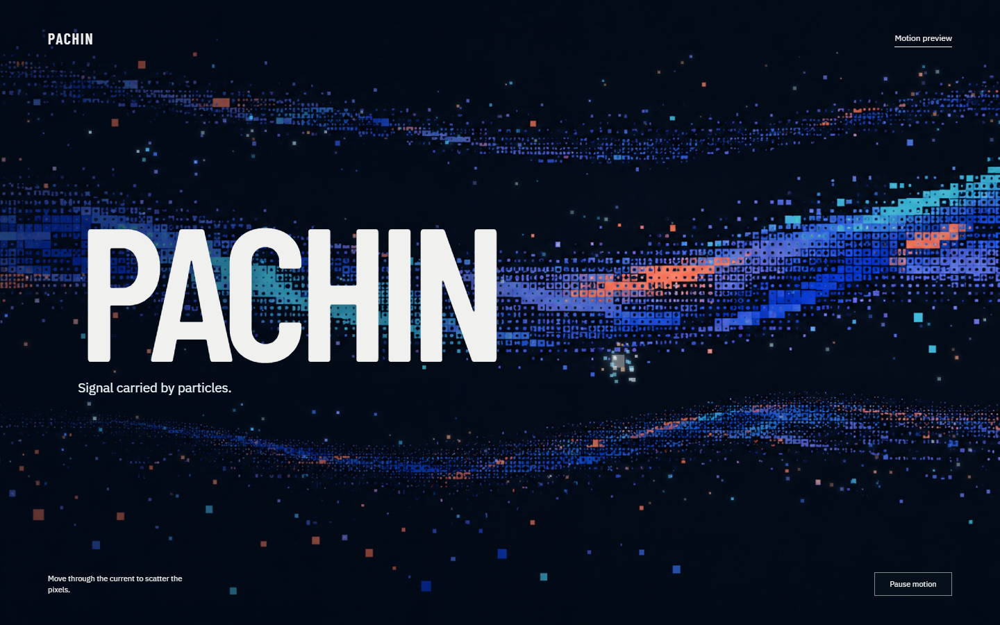

# Pixel Collision — Motion Preview

A retro-digital current for the PACHIN website: a painted pixel-wave image, a slow ambient field, and a separate interactive layer that scatters around the pointer. Moving the pointer triggers a compact collision; clicking is optional, not required.

[**Open the live preview**](https://pachin1919.github.io/pixel-collision-motion-preview/)



This is an independent art-direction study, not the production website. Use **Pause motion** or your system's reduced-motion setting to stop the interaction.

To run locally, serve this directory with a static server and open `index.html`, for example in PowerShell:

```powershell
py -m http.server 4333 --bind 127.0.0.1
```

The painting is a project-specific visual asset and is not offered for reuse. Barlow Condensed and IBM Plex Sans license texts are included in `assets/`; GSAP's license notice is included in `vendor/gsap.min.js`.
